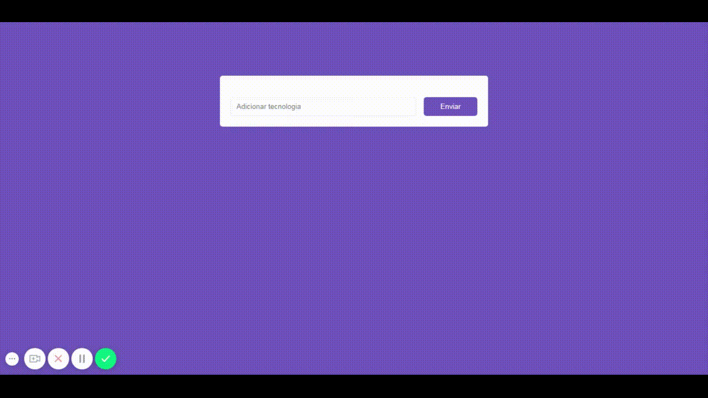

<h1 align="center">
    
</h1>

<h2 align="center">
  Código feito junto com as Aulas do 4° Módulo de introdução ao React
</h2>

  <a href="#dart-sobre-o-projeto"> Sobre o projeto </a>&nbsp;&nbsp;&nbsp;|&nbsp;&nbsp;&nbsp;
  <a href="#fire-sobre-o-desafio"> Sobre o desafio </a>&nbsp;&nbsp;&nbsp;|&nbsp;&nbsp;&nbsp;
  <a href="#memo-licença"> Licença </a>

&nbsp;

## :dart: Sobre o projeto

  

Criar uma aplicação onde seja possível adicionar, remover e listar tecnologias !

&nbsp;

## :fire: **Sobre o desafio**

O desafio do 4° modulo é desenvolver uma interface semelhante com a do Facebook utilizando React.

:point_right: [Clique Aqui](https://github.com/MauroDeSouza/react-gostack-challenge-01) :point_left: para ver o resultado !

&nbsp;

## :memo: **Licença**

Esse projeto está sob a licença MIT. Veja o arquivo [LICENSE](LICENSE.md) para mais detalhes.

---

Feito com :heart: by Mauro de Souza - Email: maurodesouza2017@hotmail.com
